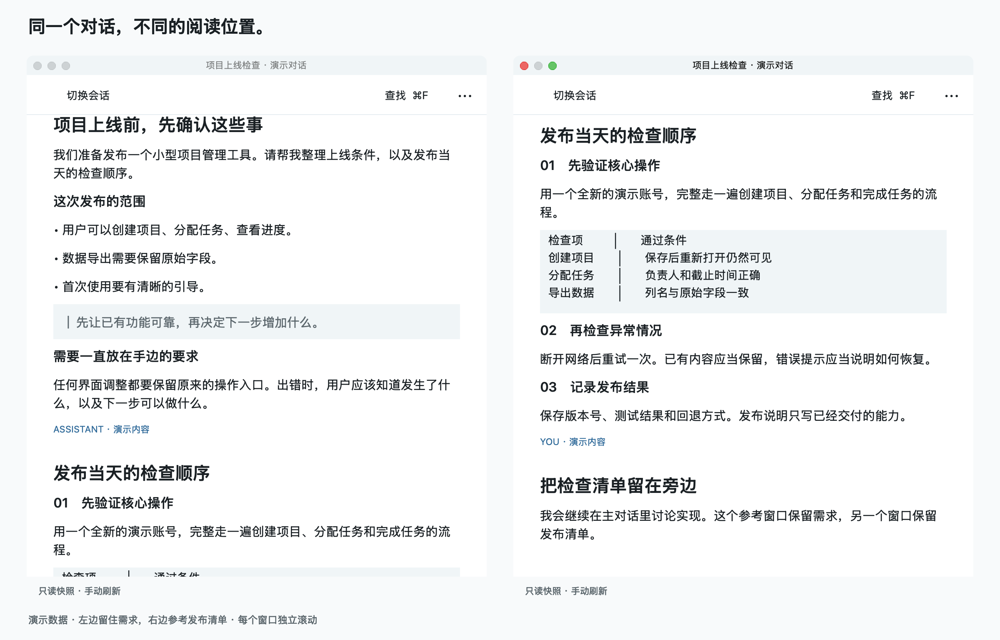
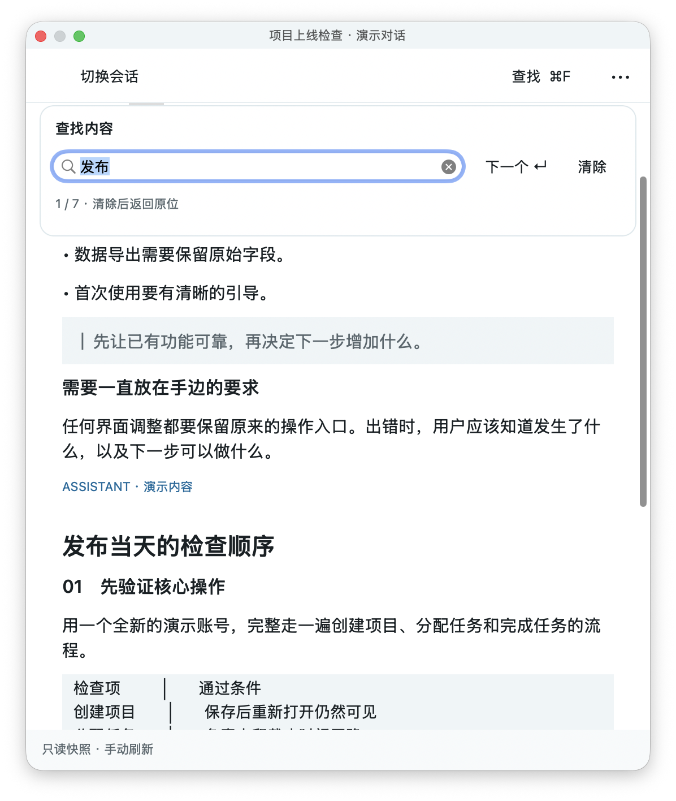
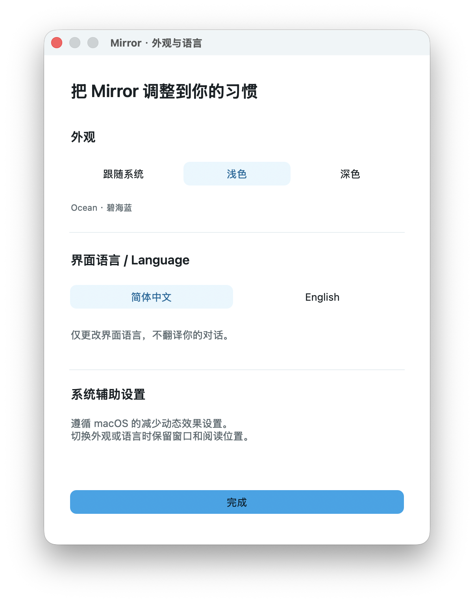
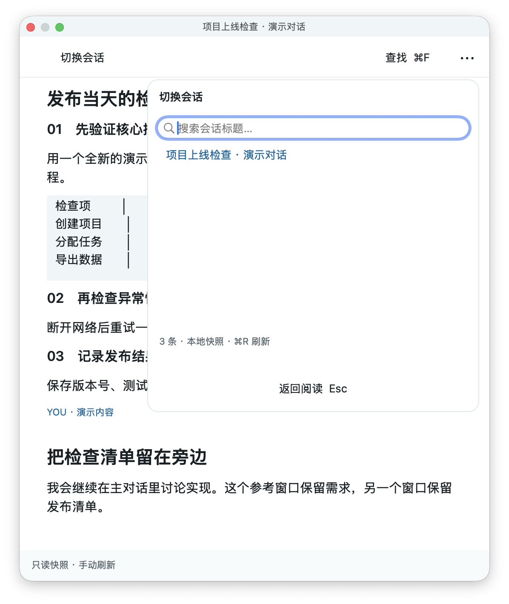
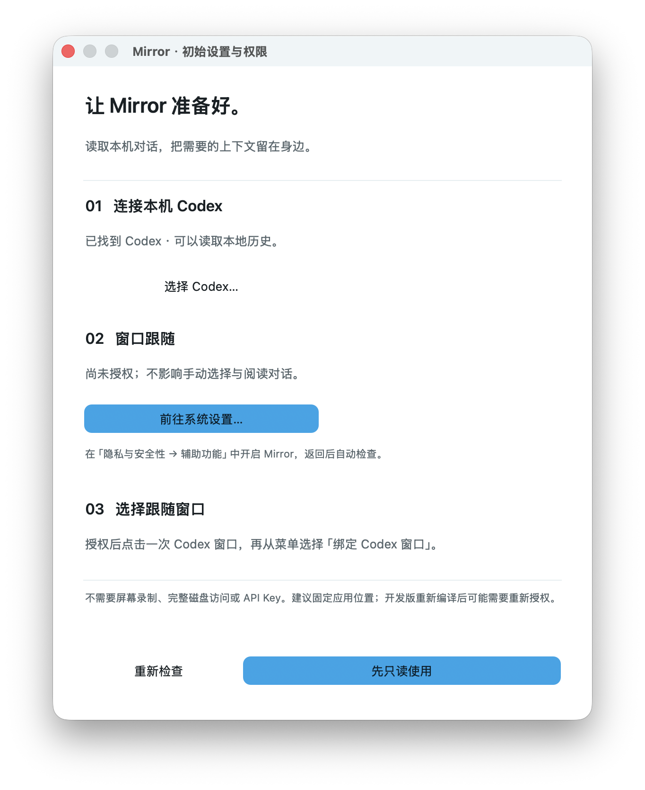

# Mirror

**Keep useful context from your AI conversations beside your work.**

[简体中文](README.md) · [Download v0.2.1](https://github.com/ChanghaoLiao/Mirror/releases/tag/v0.2.1) · [User guide](docs/usage.en.md) · [Report an issue](https://github.com/ChanghaoLiao/Mirror/issues)



Continue working in Codex while Mirror keeps earlier requirements, explanations or checklists in separate reference windows. Duplicate a window to read another part of the same conversation. Each reference keeps its own position, font size and geometry.

Mirror is a native macOS app built with Swift and AppKit. It reads existing local Codex history. It does not send messages, generate answers, or create or fork Agent tasks.

> **First public preview · v0.2.1**
> The download requires **Apple Silicon and macOS 14 or later**. It is ad-hoc signed and **not Apple notarized**; macOS may block its first launch. Read the [installation guide](docs/installation.en.md). The download does not require Xcode. Source builds require full Xcode and a Swift 6 toolchain.

## When to use it

Long conversations make it difficult to keep earlier context visible while discussing the next step. Keep requirements in one reference, an implementation in another, and a different conversation in a third.

- Read several parts of a conversation at once, or choose different conversations.
- Scroll, resize, switch and close each window independently; source data stays shared.
- Keep reading during refresh. Complete updates replace old content at your current reading position.

Screenshots show running native windows with labeled synthetic conversations. The multiwindow background is only a presentation surface. No real conversations, study materials or desktop information are included. Screenshots use the Chinese interface; the app also supports English.

## Get started

1. Download `Mirror-0.2.1-macos-arm64.zip` from the [Release](https://github.com/ChanghaoLiao/Mirror/releases/tag/v0.2.1), extract it, and put `Mirror.app` in a stable location such as Applications.
2. Open Mirror. Its menu-bar icon is **◧**. A first-run setup guide appears.
3. **Connect Codex** means selecting the installed `codex` executable to read local history, not signing into a new account or connecting to a cloud service. If discovery fails, [choose Codex manually](docs/installation.en.md#choose-codex).
4. Choose **Continue read-only** to read without Accessibility. For host following, enable **Mirror** in System Settings → Privacy & Security → Accessibility.
5. Choose **◧ → Open Reference**, or press **⇧⌘M**, then click **Conversations** and select a conversation.
6. Press **⌘D** to duplicate the reference and scroll to another section. Continue asking questions in Codex.

**Binding** tells Mirror which Codex window a group of references should follow. After granting Accessibility, focus that Codex window and choose **◧ → Bind to Codex window**. **Unbound does not mean permission is missing.** Manual selection and reading still work.

## Controls

| Task | Control |
| --- | --- |
| Open a reference | ◧ menu, or ⇧⌘M |
| Choose another conversation | Conversations; search titles or load more |
| Read two places at once | ⌘D, or ••• → Duplicate reference |
| Find text | ⌘F; Return advances, Clear restores the earlier position |
| Update history | ⌘R; keep old content during refresh; temporary connection failures retry automatically |
| Copy text | Select and ⌘C, or ••• → Copy complete message |
| Change font size | ••• → Smaller text / Larger text; current reference only |
| Hide and restore | ••• → Hide reference; ◧ → Restore hidden references |
| Close this reference | ⌘W; other references remain open |
| Appearance and language | ••• → Appearance & Language; system/light/dark and Chinese/English |
| Reconfigure | ◧ → Setup & Permissions / Choose Codex executable |

Find and conversation panels overlay the reader without narrowing it. Escape or clicking outside returns to reading. Move and resize using native title bars and edges. The menu also offers best-effort **Open at selected text**; see the [user guide](docs/usage.en.md).

## Screenshots

| Find in conversation | Appearance and language |
| --- | --- |
|  |  |

| Conversation selection | First-run setup |
| --- | --- |
|  |  |

[Dark multiwindow view](docs/screenshots/multiwindow-dark.png). Permission statuses are demonstration states, not this computer's actual authorization.

## Privacy

- Mirror uses the installed Codex CLI's official local App Server, with an allowlist for initialization, listing and reading history.
- There is no Mirror telemetry, upload service, model call or built-in account. App Server analytics is disabled at launch. Codex retains its own configuration, account and behavior.
- Conversation bodies stay in memory and are not cached to disk by Mirror. View geometry, conversation IDs, reading positions and host titles are saved locally.
- Attachment paths are not opened automatically and remote images are not downloaded. Image previews require an explicit system file-picker selection.
- Normal reading needs no Screen Recording, Full Disk Access or API key. Accessibility is optional for host identification/following and best-effort selected-text lookup.

Read the [privacy guide](docs/privacy.en.md) for boundaries and file locations, or [troubleshooting](docs/troubleshooting.en.md) for permission and binding issues.

## Current support and limitations

This preview supports **local Codex history**. Live reads and refreshes were verified with Codex CLI **0.159.0**, Apple Silicon and macOS 26.4.1. The minimum deployment target is macOS 14; every OS version, CLI version and window combination has not been fully validated.

- History is a manually refreshed snapshot; active streamed responses are not mirrored live.
- No official desktop API exposes the currently visible message. Selected-text lookup is best-effort; manual selection and explicit-ID deep links are supported.
- Basic Markdown, code and native table grids are supported. Complex nested Markdown, syntax highlighting and automatic image loading are limited or absent.
- Very large individual blocks can affect layout; full-history Find can also affect responsiveness.
- Renamed or duplicate host titles may require rebinding. Full-screen/Spaces combinations and complete real host-switching need more platform validation.
- Windows, Linux, Claude Code, Cursor and OpenCode are not supported. There is no auto-updater or notarized build.

## Validation

v0.2.1 fixes ordered reception of large fragmented responses and reconnect behavior. Disconnects/timeouts retry up to three attempts with 250/750ms backoff and a 45-second whole-history budget. Cancellation stops promptly; malformed responses and rejected requests are not retried blindly.

**29 unit tests pass**, including fragmented Chinese responses over 5MiB, disconnects, timeouts, cancellation and concurrent reads. Native regressions cover independent reading, Find, release on close, recovery, onboarding and background refresh. A real history passed **20 full reads and 20 refreshes** consecutively. The record contains timing and item counts only, without titles, IDs or bodies.

[Validation and limits](docs/validation.md) · [Read/refresh implementation](docs/reliability/README.md) · [Architecture](docs/architecture.md)

## Build from source

Requires macOS, full Xcode with XCTest and a Swift 6 toolchain. No third-party runtime dependencies. Pipeline tests use Python 3 as a development fixture only.

```sh
git clone https://github.com/ChanghaoLiao/Mirror.git
cd Mirror
bash scripts/swift.sh test -Xswiftc -warnings-as-errors
bash scripts/build.sh
open dist/Mirror.app
```

Outputs are `dist/Mirror.app` and `dist/Mirror.zip`. See [Contributing](CONTRIBUTING.md) for isolated demos and regression checks.

## Feedback and license

Open an [issue](https://github.com/ChanghaoLiao/Mirror/issues) with your version, reproduction steps and redacted screenshots. Do not attach real conversations, account information or local state. Report security issues privately as described in [SECURITY.md](SECURITY.md).

Maintained by [ChanghaoLiao](https://github.com/ChanghaoLiao). [MIT licensed](LICENSE). Independent of, and not affiliated with or endorsed by, OpenAI.
